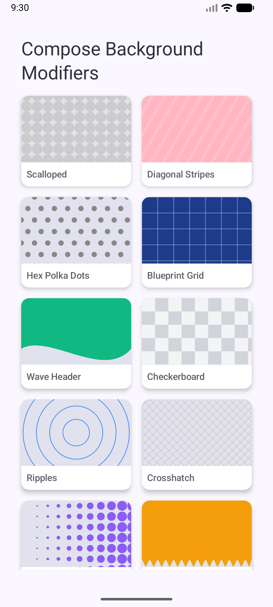

# Jetpack Compose Background Patterns 🎨

## Main Aim 🎯
The primary goal of this project is to demonstrate the power of Jetpack Compose's `Modifier.drawBehind` API as a modern, high-performance alternative to legacy XML drawables. 

In traditional Android development, creating complex repeating patterns, dynamic gradients, or adaptive borders required stacking XML `<bitmap>` layers, writing cumbersome `<layer-list>` drawables, or importing heavy SVGs that stretch awkwardly on tablets.

By leveraging `Modifier.drawBehind`, we can build fully dynamic, scalable, and complex geometric backgrounds using simple math and Canvas primitives directly within the UI layer—with zero view hierarchy overhead.

## The Modifiers
This repository contains 10 plug-and-play modifiers spanning from optical illusions to woven crosshatches.

### Preview 📸
Here is a quick look at the backgrounds in action on a device:

### Video Demo 🎥
Check out the fully adaptive, scrolling implementation:

<video src="background-modifiers.webm" controls="controls" style="max-width: 100%;">
  Your browser does not support the video tag.
</video>
